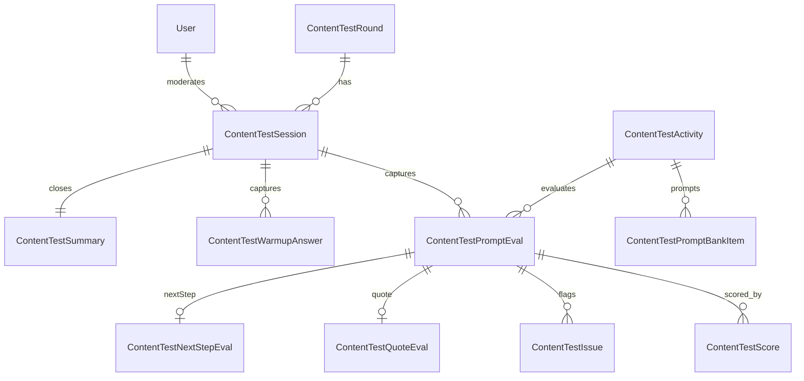

# Content Testing Session Assistant — PRD

> Status: v1 — implemented in this repository (`app/content/testing/*`, `app/api/content-testing/*`).
> Source of truth: Army Answers Moderator Guide for Content Testing.

## 1. Purpose

Turn the Army Answers Moderator Guide for Content Testing into an in-app tool that:
- Walks one tester through every activity from the guide.
- Captures structured evaluations of the chatbot under test (SUT).
- Aggregates raw data into a moderator dashboard and an exportable backlog.

The product is **System-Under-Test agnostic** (SUT-agnostic): the tester uses any chatbot in another tab and pastes / summarizes responses. There is no need to embed the SUT.

## 2. Goals

| Goal | Metric |
| --- | --- |
| Replace the static PDF/spreadsheet workflow | 100% of moderator-guide fields are captured in app |
| Speed up live sessions | Median session run-time ≤ 60 min for 8–10 prompts |
| Reduce inter-moderator variance | All required scoring criteria enforced per activity |
| Make findings actionable | Backlog with severity, owner, action, status |
| Track iteration progress | Round-over-round comparisons via the dashboard |

## 3. Out of scope (v1)

- Embedded chatbot under test.
- Public unauthenticated tester invite links (schema is ready; route is stubbed for Phase 2).
- Multi-observer simultaneous scoring on the same prompt.
- AI-generated synthesis of session summaries.

## 4. Users & roles

| Role | Where | Permissions |
| --- | --- | --- |
| Moderator | `/content/testing/run/[sessionId]` and dashboard | Create + run sessions, score prompts, tag issues, complete sessions |
| Observer | Dashboard, session detail | Read sessions, no edit (observerIds stored on session) |
| Content strategist / UX researcher | Dashboard, backlog, exports | Read + change issue triage fields |
| Admin | All of the above + `/content/testing/prompt-bank` | CRUD on the prompt bank |

User `role` is stored on the `User` model (`UserRole { ADMIN, MEMBER }`). The seed script honors `CONTENT_TESTING_ADMIN_EMAIL` to bootstrap the first admin.

## 5. Two-surface UX

### 5.1 Tester surface — `/content/testing/run/[sessionId]`

A three-pane "Virtual Moderator" experience.

- **Left rail**: 14-step progress, grouped into Session / Core Activities / Edge & Adversarial (Setup → Intro & Consent → Warm-up → Core 1–4 → Edge 5–8 → Wrap-up → Session Summary → Review & Complete) with not-started / in-progress / complete / needs-review states.
- **Center**: contextual activity body
  - Setup, Intro & Consent: confirm metadata, read script, capture consent + recording flag.
  - Warm-up & Wrap-up: structured question/answer cards.
  - Core (1–4) and Edge (5–8) activities: predefined prompt chips + free-text prompt entry → expandable prompt evaluation cards with tabs (Response, Scores, Issues, Quote, Next step). Autosaves every ~1.2s. The Quote tab is optional, used only when a response includes a quote.
  - Session Summary: moderator-level summary capture (trust / helpfulness / readiness, top recommendations).
  - Review & Complete: checklist + "Mark session complete".
- **Right rail (xl+)**: required scoring criteria for the current activity, activity objective, sensitive/adversarial tone reminders.

Rules:
- A prompt cannot be marked complete until every required criterion for its activity is scored.
- Sensitive and Adversarial activities default new issues to High severity and show a calmer-tone banner.
- Predefined prompts come from the seeded prompt bank, filtered to the current activity.

### 5.2 Moderator / admin surface — `/content/testing/*`

- **Dashboard** `/content/testing/dashboard`
  - KPI strip (Prompts, Sessions, Critical, High)
  - Readiness gauge (composite of overall_readiness)
  - Average score by criterion (BarChart)
  - Activity × criterion heatmap
  - Issue type donut + severity stack
  - Topic risk matrix (scatter, bubble = prompt count)
  - Quote quality + Next-Best-Action mini cards
  - Lowest-scoring prompts table
  - Critical/High issues triage table
  - Round and participant-type filters
  - Inline export buttons (Raw CSV, Raw XLSX, Summary PDF)
- **Rounds** `/content/testing/rounds` — versioned rounds (R1, R2…) with status + default environment.
- **Sessions** `/content/testing/sessions` — table view, filters by round / status / participant type, Resume / Begin per row, link to detail.
- **New Session** `/content/testing/sessions/new` — setup wizard (round, participant id + type, environment, objective, consent + recording).
- **Session detail** `/content/testing/sessions/[id]` — read view of every prompt eval, scores, issues, summary, per-session exports.
- **Prompt Bank** `/content/testing/prompt-bank` — admin-only CRUD of seeded + new prompts.
- **Backlog** `/content/testing/backlog` — every tagged issue with severity / type / owner / status filters and inline triage; CSV + XLSX export.

## 6. Activity catalog

The seeded catalog (`lib/content-testing/catalog.ts`) contains 14 activities matching the revised moderator guide. Testing is organized into two question categories — **Core Use Cases** (4 topics) and **Edge / Out-of-Scope** (4 adversarial/misuse activities) — for a target session length of 25–30 minutes.

| Order | Slug | Type | Captures prompts | Required criteria |
| ---: | --- | --- | :---: | --- |
| 1 | setup | Setup | – | – |
| 2 | introduction-and-consent | Intro & Consent | – | – |
| 3 | warm-up | Warm-up | – | – |
| 4 | core-joining-the-army | Core: Joining the Army | ✓ | 11 core |
| 5 | core-culture-lifestyle | Core: Army Culture & Lifestyle | ✓ | 11 core |
| 6 | core-jobs-careers | Core: Jobs & Career Paths | ✓ | 11 core |
| 7 | core-benefits | Core: Short-/Long-term Benefits | ✓ | 11 core |
| 8 | ambiguous-questions | Edge: Ambiguous | ✓ | 11 core |
| 9 | out-of-scope-questions | Edge: Out-of-scope / High-specificity | ✓ | 11 core |
| 10 | sensitive-content | Edge: Sensitive | ✓ | 11 core + sensitivity_handling |
| 11 | adversarial-prompts | Edge: Misuse / "Break the Bot" | ✓ | 11 core + sensitivity_handling |
| 12 | wrap-up | Wrap-up | – | – |
| 13 | session-summary | Summary | – | – |
| 14 | review-and-complete | Close | – | – |

Core criteria (11): relevance, completeness, accuracy, clarity, readability, authenticity, trustworthiness, brand_voice, brand_safety, next_best_action, overall_readiness.

Quote evaluation and Next-Best-Action evaluation are optional, captured per prompt when a response includes a quote or should provide a next step — there is no longer a dedicated influencer/supporter or quote activity. Retired activities (`common-prospect-questions`, `influencer-supporter-questions`, `quote-and-soldier-perspective`, `brand-voice-and-tone`, `accuracy-and-completeness`) are deactivated via `ContentTestActivity.isActive = false` by the seed (non-destructive), so historical session data is preserved while they no longer appear in the run flow or prompt bank.

## 7. Data model

Eleven new Prisma models (`prisma/schema.prisma`):
- Catalogs: `ContentTestActivity`, `ContentTestCriterion`, `ContentTestPromptBankItem`.
- Operational: `ContentTestRound`, `ContentTestSession`, `ContentTestPromptEval`, `ContentTestScore`, `ContentTestIssue`, `ContentTestQuoteEval`, `ContentTestNextStepEval`, `ContentTestWarmupAnswer`, `ContentTestSummary`, `ContentTestInviteToken`.

ER diagram:



User has gained `role: UserRole` (default `MEMBER`).

## 8. API

All routes under `app/api/content-testing/*` and protected by NextAuth.

| Method | Path | Notes |
| --- | --- | --- |
| GET | `/activities` | Returns activities (with prompt bank) + criteria |
| GET POST | `/rounds` | List + create rounds |
| GET PATCH DELETE | `/rounds/[id]` | |
| GET POST | `/sessions` | List + create sessions (filters: status, roundId, participantType) |
| GET PATCH DELETE | `/sessions/[id]` | |
| POST | `/sessions/[id]/complete` | Marks session COMPLETE |
| PUT | `/sessions/[id]/warmup` | Upserts warm-up + wrap-up answers (shared model) |
| POST | `/sessions/[id]/prompt-evals` | Creates prompt eval inside an activity |
| PUT | `/sessions/[id]/summary` | Upserts session summary |
| GET PATCH DELETE | `/prompt-evals/[id]` | |
| GET POST | `/prompt-evals/[id]/scores` | Bulk score upsert (null = delete) |
| GET POST | `/prompt-evals/[id]/issues` | |
| PUT | `/prompt-evals/[id]/quote-eval` | Upsert quote evaluation |
| PUT | `/prompt-evals/[id]/next-step-eval` | Upsert next-step evaluation |
| GET | `/issues` | Backlog filters |
| PATCH DELETE | `/issues/[id]` | |
| GET POST | `/prompt-bank` | Admin POST |
| PATCH DELETE | `/prompt-bank/[id]` | Admin only |
| GET | `/aggregations` | Dashboard data with round / participant / topic filters |
| GET | `/export` | `format=csv|xlsx|json|pdf` × `type=raw|backlog|summary` |

## 9. Migrations & seeding on Vercel

`vercel.json` build command:
```
prisma generate && prisma migrate deploy && npx tsx prisma/seed.ts && next build
```

The seed script (`prisma/seed.ts`) is idempotent — upserts criteria and activities by stable keys (`key`, `slug`) and inserts prompt-bank items only when a matching `(activitySlug, promptText)` pair is missing. Existing operational data (sessions, prompt evals) is never touched by the seed.

Optional `CONTENT_TESTING_ADMIN_EMAIL` env var promotes a user to admin on each deploy.

## 10. Acceptance criteria (v1)

- [x] 15 moderator-guide activities, all capture fields represented in the tester surface.
- [x] Required scoring criteria are enforced per activity.
- [x] Tester can complete a session end-to-end without referencing the PDF.
- [x] Dashboard shows readiness gauge + criterion bar + heatmap + issue donut + severity stack + topic risk matrix + lowest-scoring prompts + critical/high issues + quote + next-step summary.
- [x] Raw CSV / JSON / XLSX include every prompt-level field plus all 13 criterion scores.
- [x] Aggregated PDF includes executive summary, criterion averages, severity, lowest prompts, critical/high issues.
- [x] Backlog filterable by severity, status, issue type, with inline action / owner / status / priority edits.
- [x] Vercel deploy auto-runs `migrate deploy` + idempotent seed, leaving a populated catalog without manual steps.
- [x] Pill Research entry point still works from new sub-nav (`/content/segue-pills/list`).

## 11. Future (Phase 2+)

- Tokenized invite links to let external testers run a session without an account (schema already includes `ContentTestInviteToken`).
- Embedded SUT mode (the chatbot under test renders inside the tester surface, captures responses verbatim).
- AI-assisted synthesis of session summaries from prompt evals.
- Multi-observer simultaneous scoring with conflict resolution.
- Round comparison view (R1 vs R2 side-by-side).
- Round-over-round time-series chart on the dashboard.
- Slack / email notifications for critical issues.

## 12. Open follow-ups

- Confirm whether Pill Research and the Q&A projects should ultimately live behind the same Content sub-nav (current implementation: yes).
- Define a more granular admin assignment policy beyond `CONTENT_TESTING_ADMIN_EMAIL`.
- Decide whether warm-up and wrap-up answers should be a separate model (currently consolidated under `ContentTestWarmupAnswer` keyed by `questionKey`).
